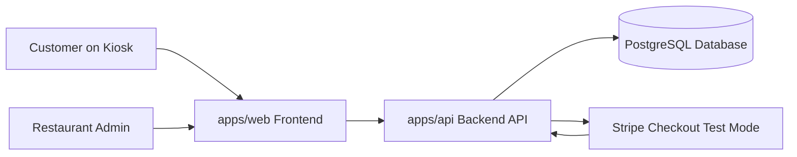

# System Overview

## Purpose
This document describes the high-level system architecture of the Food Ordering Kiosk App and the main responsibilities of each major part of the platform.

## Summary
The Food Ordering Kiosk App is planned as a full-stack web application with a kiosk-oriented customer frontend, a protected admin area, a backend API, a relational database, and Stripe test-mode payment integration. The system is intended to support one restaurant with multiple menus, shared categories and products, menu-specific pricing, scheduled availability, and both simple standalone products and configurable meals with grouped selections and ingredient personalization. The project is organized as a monorepo to keep frontend, backend, shared packages, and documentation in one repository.

## Core Architecture
- Frontend application in `apps/web`
- Backend application in `apps/api`
- Shared packages in `packages/*`
- Product, architecture, testing, and deployment documentation in `docs/*`
- Planning artifacts in `backlog/*`

## Main System Components

### 1. Kiosk Frontend
The frontend is a React and TypeScript application intended for kiosk-style ordering.

Responsibilities:
- Display menu categories and products
- Support search and product discovery
- Allow customer language selection and localized kiosk copy
- Show only menus, categories, and products that are currently available
- Guide customers through meal-building and product personalization
- Manage basket and order summary flow
- Start Stripe Checkout
- Show customer-facing status, success, and failure states
- Provide accessibility-oriented and touch-friendly interactions

### 2. Admin Area
The admin area is part of the web product scope and is intended for restaurant administrators only.

Responsibilities:
- Provide administrator login and registration flow
- Restrict access to protected admin features
- Display incoming orders
- Display payment-related states
- Allow order status management

### 3. Backend API
The backend is a NestJS application responsible for core business logic and trusted system operations.

Responsibilities:
- Serve application data to the frontend
- Handle restaurant, menu, catalog, basket, order, and admin-related operations
- Validate meal selections and product personalization rules
- Resolve menu, category, and product availability by schedule and visibility
- Enforce authentication and authorization rules
- Validate incoming data
- Create Stripe Checkout sessions
- Receive and verify Stripe webhook events
- Confirm payment state through backend logic

### 4. Database
The planned database is PostgreSQL, with Prisma intended for data access and schema management.

Responsibilities:
- Store restaurant data
- Store menu structure and availability rules
- Store catalog data
- Store configurable meal structures and personalization rules
- Store admin account data
- Store orders
- Store payment-related state
- Persist system data needed for application workflows

### 5. Stripe Integration
Stripe is used for customer payments in test mode only during MVP development.

Responsibilities:
- Host the payment checkout flow
- Return customer payment flow results to the application
- Send webhook events to the backend for payment verification

## High-Level Flow
1. The customer opens the kiosk start screen and can choose a supported language.
2. The system resolves the currently active menu based on restaurant scheduling and visibility rules.
3. The customer uses the kiosk frontend to browse the currently available categories and products.
4. The customer selects a standalone product, meal, or large meal.
5. If the selection is configurable, the customer completes required group selections and personalization.
6. The customer adds the configured product to the basket and reviews the order summary.
7. The frontend requests checkout creation from the backend.
8. The backend validates the configured order and creates a Stripe Checkout session.
9. The customer completes or exits the Stripe payment flow.
10. Stripe notifies the backend through webhook events.
11. The backend verifies payment status and updates the order state.
12. The frontend shows a customer-facing result.
13. The admin area displays the resulting order and payment information.

## Mermaid Diagram

## Architectural Principles
- Keep customer and admin concerns clearly separated
- Treat backend validation as the source of truth for orders and payments
- Keep product configuration rules validated on the backend
- Keep payment confirmation webhook-driven
- Keep kiosk language selection simple, visible, and session-scoped for the customer flow
- Keep menu visibility and scheduling evaluated on the backend so the kiosk reflects the current restaurant offering consistently
- Prefer clear monorepo boundaries between apps and shared packages
- Support future scalability without overcomplicating the MVP
- Leave room for later upsell capability without making it part of the initial MVP model
- Keep accessibility, security, and maintainability as first-class design concerns

## Status
Planned. This document describes intended architecture and does not claim that all components are already implemented.
