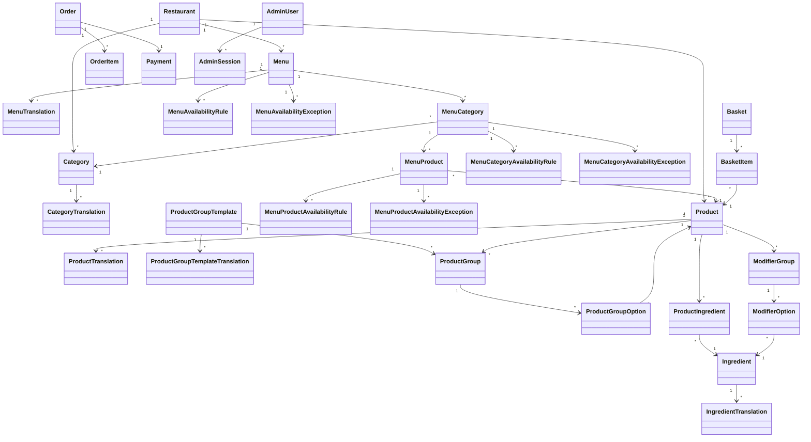

# Domain Model

## Purpose
This document defines the core domain entities for the Food Ordering Kiosk App and describes how they relate to each other at a high level.

## Summary
The MVP domain model centers on one restaurant with multiple menus, reusable categories, reusable products, configurable meals, reusable meal groups, product personalization, basket building, order creation, payment verification, localization support, and administrator access. The model should remain simple enough for an MVP while leaving room for later growth such as upsell logic.

## Core Entities

### Restaurant
Represents the single restaurant that owns the kiosk, menus, categories, products, and configuration in the MVP.

Suggested attributes:
- `id`
- `name`
- `slug`
- `timezone`
- `defaultLocale`
- `currency`
- `isActive`

### Menu
Represents a menu owned by the restaurant, such as breakfast, lunch, or seasonal menu.

Suggested attributes:
- `id`
- `restaurantId`
- `code`
- `name`
- `description`
- `sortOrder`
- `isActive`

### Menu Translation
Represents localized menu text for a supported language.

Suggested attributes:
- `id`
- `menuId`
- `locale`
- `name`
- `description`

### Category
Represents a reusable grouping used to organize products for browsing.

Example responsibilities:
- Group related products
- Support kiosk browsing and filtering
- Provide reusable catalog structure across menus

Suggested attributes:
- `id`
- `restaurantId`
- `code`
- `name`
- `description`
- `sortOrder`
- `isActive`

### Category Translation
Represents localized category text for a supported language.

Suggested attributes:
- `id`
- `categoryId`
- `locale`
- `name`
- `description`

### Product
Represents a purchasable catalog entity offered by the restaurant.

Example responsibilities:
- Display product information to customers
- Support search and discovery
- Provide catalog-level pricing data
- Represent either a standalone item, a meal, or a large meal
- Allow the same product to be sold standalone and also reused as a meal option when needed

Suggested attributes:
- `id`
- `restaurantId`
- `type`
- `sku`
- `name`
- `description`
- `basePrice`
- `imageUrl`
- `isAvailable`
- `isStandaloneOrderable`
- `canBeMealOption`
- `sortOrder`

Suggested type examples:
- `item`
- `meal`
- `large_meal`

### Product Translation
Represents localized product text for a supported language.

Suggested attributes:
- `id`
- `productId`
- `locale`
- `name`
- `description`

### Menu Category
Represents a category assignment inside a specific menu.

Purpose:
- Reuse a category across multiple menus
- Control category order per menu
- Control category visibility and availability per menu

Suggested attributes:
- `id`
- `menuId`
- `categoryId`
- `sortOrder`
- `isVisible`

### Menu Product
Represents a product assignment inside a specific menu category.

Purpose:
- Reuse the same product across menus and categories
- Support menu-specific pricing
- Support menu-specific visibility and availability

Suggested attributes:
- `id`
- `menuCategoryId`
- `productId`
- `menuPrice`
- `sortOrder`
- `isVisible`

### Menu Availability Rule
Represents date and time-based availability for a menu.

Suggested attributes:
- `id`
- `menuId`
- `startDate`
- `endDate`
- `daysOfWeek`
- `startTimeLocal`
- `endTimeLocal`
- `timezone`
- `isActive`

### Menu Availability Exception
Represents a one-off override for a menu, such as a holiday closure, temporary closure, or special one-day availability change.

Suggested attributes:
- `id`
- `menuId`
- `startDateTimeLocal`
- `endDateTimeLocal`
- `timezone`
- `overrideType`
- `isClosed`
- `reason`
- `isActive`

### Menu Category Availability Rule
Represents date and time-based availability for a category inside a specific menu.

Suggested attributes:
- `id`
- `menuCategoryId`
- `startDate`
- `endDate`
- `daysOfWeek`
- `startTimeLocal`
- `endTimeLocal`
- `timezone`
- `isActive`

### Menu Category Availability Exception
Represents a one-off override for a category inside a specific menu.

Suggested attributes:
- `id`
- `menuCategoryId`
- `startDateTimeLocal`
- `endDateTimeLocal`
- `timezone`
- `overrideType`
- `isClosed`
- `reason`
- `isActive`

### Menu Product Availability Rule
Represents date and time-based availability for a product inside a specific menu category.

Suggested attributes:
- `id`
- `menuProductId`
- `startDate`
- `endDate`
- `daysOfWeek`
- `startTimeLocal`
- `endTimeLocal`
- `timezone`
- `isActive`

### Menu Product Availability Exception
Represents a one-off override for a product inside a specific menu category.

Suggested attributes:
- `id`
- `menuProductId`
- `startDateTimeLocal`
- `endDateTimeLocal`
- `timezone`
- `overrideType`
- `isClosed`
- `reason`
- `isActive`

### Product Group Template
Represents a reusable meal-group definition that can be attached to multiple meal products.

Examples:
- Sandwich
- Side
- Drink

Suggested attributes:
- `id`
- `code`
- `name`
- `defaultMinSelections`
- `defaultMaxSelections`
- `defaultSelectionMode`
- `isActive`
- `createdAt`
- `updatedAt`

### Product Group Template Translation
Represents localized reusable meal-group text for a supported language.

Suggested attributes:
- `id`
- `productGroupTemplateId`
- `locale`
- `name`

### Product Group
Represents a meal-specific assignment of a reusable `Product Group Template` to a configurable product.

Examples:
- A burger meal using the reusable `drink` group
- A large meal using the reusable `side` group with different selection limits

Suggested attributes:
- `id`
- `productId`
- `productGroupTemplateId`
- `nameOverride`
- `minSelections`
- `maxSelections`
- `selectionMode`
- `sortOrder`
- `isRequired`

### Product Group Option
Represents a selectable product inside a `Product Group`.

Suggested attributes:
- `id`
- `productGroupId`
- `productId`
- `priceAdjustment`
- `sortOrder`
- `isDefault`
- `isAvailable`

### Ingredient
Represents a reusable ingredient definition used for product composition and personalization.

Examples:
- Cheese
- Tomato
- Bacon
- Sauce

Suggested attributes:
- `id`
- `code`
- `name`
- `description`
- `isActive`
- `createdAt`
- `updatedAt`

### Ingredient Translation
Represents localized ingredient text for a supported language.

Suggested attributes:
- `id`
- `ingredientId`
- `locale`
- `name`
- `description`

### Product Ingredient
Represents an ingredient rule attached to a specific product.

Purpose:
- Define which ingredients belong to a product
- Define whether an ingredient is included by default
- Define whether it can be removed
- Define whether extra quantity is allowed
- Define price changes for removal or extras

Suggested attributes:
- `id`
- `productId`
- `ingredientId`
- `defaultQuantity`
- `isDefaultIncluded`
- `isRemovable`
- `removePriceAdjustment`
- `allowExtra`
- `extraUnitPrice`
- `maxExtraQuantity`
- `sortOrder`
- `isAvailable`

### Modifier Group
Represents a personalization rule set for a product, such as adding or removing ingredients.

Examples:
- Remove ingredients
- Add extra ingredients

Suggested attributes:
- `id`
- `productId`
- `name`
- `actionType`
- `selectionType`
- `minSelections`
- `maxSelections`
- `allowQuantity`
- `sortOrder`
- `isRequired`

### Modifier Option
Represents a specific ingredient or add-on choice inside a `Modifier Group`.

Suggested attributes:
- `id`
- `modifierGroupId`
- `ingredientId`
- `productIngredientId`
- `priceAdjustment`
- `maxQuantity`
- `sortOrder`
- `isAvailable`

### Basket
Represents the temporary customer selection before checkout.

Example responsibilities:
- Hold selected products during the kiosk session
- Support summary and total calculation before payment
- Allow customer changes before checkout

Suggested attributes:
- `id`
- `sessionId`
- `status`
- `subtotalAmount`
- `createdAt`
- `updatedAt`

### Basket Item
Represents an individual configured product inside the basket.

Suggested attributes:
- `id`
- `basketId`
- `productId`
- `productNameSnapshot`
- `quantity`
- `unitPrice`
- `lineTotal`
- `configurationSnapshot`

### Order
Represents a customer purchase attempt created from the basket.

Example responsibilities:
- Preserve the requested items and totals
- Track operational restaurant workflow
- Link business order flow with payment flow

Suggested attributes:
- `id`
- `orderNumber`
- `status`
- `paymentStatus`
- `subtotalAmount`
- `totalAmount`
- `createdAt`
- `updatedAt`

### Order Item
Represents a purchased product snapshot stored with the order.

Suggested attributes:
- `id`
- `orderId`
- `productId`
- `productName`
- `productType`
- `unitPrice`
- `quantity`
- `lineTotal`
- `configurationSnapshot`

### Payment
Represents the payment lifecycle associated with an order.

Example responsibilities:
- Track Stripe Checkout session data
- Track payment verification state
- Support safe reconciliation between frontend and backend states

Suggested attributes:
- `id`
- `orderId`
- `provider`
- `providerSessionId`
- `providerPaymentIntentId`
- `status`
- `amount`
- `currency`
- `createdAt`
- `updatedAt`

### Upsell Recommendation Rule
Represents a future recommendation rule that suggests related products before basket confirmation.

Suggested attributes:
- `id`
- `sourceProductId`
- `targetProductId`
- `priority`
- `isActive`

Status:
- Later, not part of the MVP implementation scope

### Admin User
Represents an authenticated administrator with access to the admin panel.

Example responsibilities:
- Authenticate into the protected admin area
- Manage incoming orders
- Operate within the admin workflow

Suggested attributes:
- `id`
- `email`
- `passwordHash`
- `role`
- `isActive`
- `lastLoginAt`
- `createdAt`
- `updatedAt`

### Admin Session
Represents an authenticated admin access session.

Suggested attributes:
- `id`
- `adminUserId`
- `tokenId`
- `expiresAt`
- `createdAt`
- `revokedAt`

## Domain Relationships
- One `Restaurant` can contain many `Menus`.
- One `Restaurant` can contain many `Categories`.
- One `Restaurant` can contain many `Products`.
- One `Menu` can contain many `Menu Categories`.
- One `Menu` can contain many `Menu Availability Rules`.
- One `Menu` can contain many `Menu Availability Exceptions`.
- One `Menu` can contain many `Menu Translations`.
- One `Menu Category` references one `Category`.
- One `Menu Category` can contain many `Menu Products`.
- One `Menu Category` can contain many `Menu Category Availability Rules`.
- One `Menu Category` can contain many `Menu Category Availability Exceptions`.
- One `Menu Product` references one `Product`.
- One `Menu Product` can contain many `Menu Product Availability Rules`.
- One `Menu Product` can contain many `Menu Product Availability Exceptions`.
- One `Category` can contain many `Category Translations`.
- One `Product` can contain many `Product Translations`.
- One `Product Group Template` can contain many `Product Group Template Translations`.
- One `Ingredient` can contain many `Ingredient Translations`.
- One `Product Group Template` can be reused by many `Product Groups`.
- One `Product` can contain many `Product Groups`.
- One `Product Group` can contain many `Product Group Options`.
- One `Product Group Option` references one `Product`.
- One `Product` can contain many `Product Ingredients`.
- One `Product Ingredient` references one `Ingredient`.
- One `Product` can contain many `Modifier Groups`.
- One `Modifier Group` can contain many `Modifier Options`.
- One `Modifier Option` can reference one `Ingredient` and optionally one `Product Ingredient`.
- One `Basket` can contain many `Basket Items`.
- One `Basket Item` references one `Product`.
- One `Order` contains many `Order Items`.
- One `Order` may be created from one basket flow.
- One `Order` has one current payment state.
- One `Payment` belongs to one `Order`.
- One `Admin User` can have one or more `Admin Sessions` over time.

## Status Concepts

### Order Status
Represents restaurant workflow state.

Examples:
- `new`
- `in_progress`
- `ready`
- `completed`
- `cancelled`

### Payment Status
Represents payment verification state.

Examples:
- `pending`
- `awaiting_payment_confirmation`
- `paid`
- `failed`
- `cancelled`

## Mermaid Diagram

## Design Notes
- `Order status` and `payment status` should remain separate because restaurant workflow and payment truth are different concerns.
- The MVP supports only one restaurant, but `Restaurant` should still exist as an explicit root entity because menus, categories, products, scheduling, and kiosk configuration all belong to it.
- Products do not belong directly to one active menu category. Instead, products should be assigned through `Menu Product` and `Menu Category` so the same product can appear in multiple menus and categories.
- `Meal` and `large meal` are intentionally modeled as separate product types because they can have different pricing, descriptions, and images.
- The same `Product` may be sold standalone and also reused as a selectable option inside a meal.
- Menu-specific pricing should live on `Menu Product`, while `Product.basePrice` remains the catalog-level default or fallback price.
- Categories are reusable definitions, while `Menu Category` controls how and when they appear in a specific menu.
- Meal pricing should be owned by the meal product itself, while `Product Group Options` may add price adjustments for upgraded choices.
- Reusable group templates should exist separately from meal-specific group assignments so different meals can share the same logical groups without forcing identical configuration.
- Default selection behavior may be one option, but the domain must support multiple selections where required.
- Ingredient behavior belongs to the selected product, not to the meal as a whole.
- Product ingredient rules should support products that have no ingredients at all.
- Both adding and removing ingredients may change the final price, so removal and extra pricing rules should be stored explicitly.
- Availability should be manageable at menu, menu-category, menu-product, meal-option, product-ingredient, and modifier-option level so admins can hide or schedule parts of the catalog as unavailable.
- Dedicated availability-rule entities are preferable here because recurring date/time availability is a first-class concept and should not be reduced to a single boolean flag.
- One-off exceptions such as holidays, temporary closures, and one-day overrides should be modeled separately from recurring weekly rules so schedule resolution stays explicit and maintainable.
- `Basket Item` and `Order Item` should store configuration snapshots so selected meal groups and ingredient changes are preserved even if the catalog changes later.
- `Order Items` should store a snapshot of product name and price at purchase time rather than depending only on future catalog state.
- `Basket` is modeled as temporary session data, while `Order` is persistent business data.
- `Admin Session` is modeled separately so session expiration and revocation remain explicit.
- Multilingual kiosk support is easier to scale if translatable catalog fields are stored in dedicated translation tables instead of hardcoding one language per row.
- Customer language choice is primarily a kiosk session concern rather than a core business entity, and it should persist through the active ordering flow before resetting to a default state for the next customer.

## Status
Planned. This document defines intended domain structure and does not imply implementation is complete.
