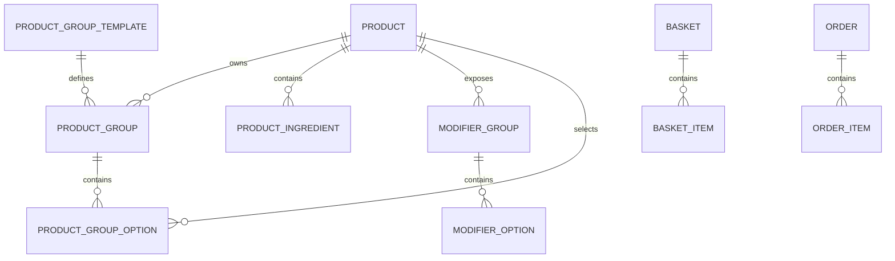
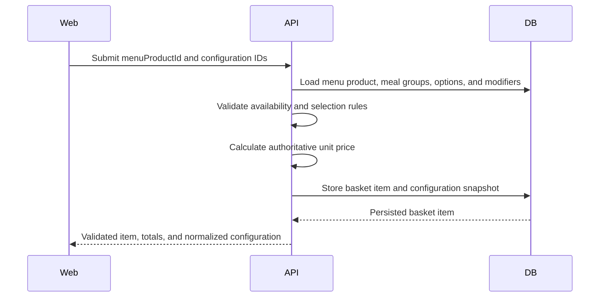

# Meal Builder Architecture

## Status

Draft architecture for review.

The database and read-side catalog foundation partially exist. Basket writes, authoritative configuration validation, and frontend integration remain planned.

## Goal

Represent a meal as a normal catalog product with a configurable set of reusable selection groups.

The design must support:

- standalone items
- meals
- large meals
- reusable group templates
- meal-specific option sets
- option price adjustments
- linked regular and large meal products
- product personalization
- backend-authoritative pricing
- immutable basket and order snapshots

## Domain Model



### Product

`Product.type` determines the product behavior:

- `ITEM`: standalone product
- `MEAL`: configurable bundle
- `LARGE_MEAL`: configurable larger bundle

`Product` remains reusable. Menu placement and menu-specific price remain owned by `MenuProduct`.

### Regular And Large Meal Relationship

Regular and large meals are separate database products:

- regular product type: `MEAL`
- large product type: `LARGE_MEAL`

The large meal has its own:

- product identity and SKU
- base or menu price
- product groups
- group options
- option surcharges
- availability

The two products require an explicit relationship. The current schema does not yet contain that relationship.

Recommended initial schema direction:

```prisma
model Product {
  id                 String    @id @default(uuid()) @db.Uuid
  regularMealId      String?   @unique @map("regular_meal_id") @db.Uuid
  regularMeal        Product?  @relation("MealSizeVariant", fields: [regularMealId], references: [id])
  largeMealVariant   Product?  @relation("MealSizeVariant")
}
```

Application validation must enforce:

- only `LARGE_MEAL` may set `regularMealId`
- the referenced product must be `MEAL`
- both products belong to the same restaurant
- a regular meal has at most one linked large meal in the initial implementation

The exact field and relation names may change during implementation.

### Product Group Template

Defines reusable group meaning and default constraints.

Examples:

- `meal-main`
- `meal-side`
- `meal-drink`

### Product Group

Attaches a template to one meal product and owns the effective constraints for that meal.

The values on `ProductGroup` override template defaults and are authoritative during configuration validation.

### Product Group Option

Allows a product to be selected inside a group.

The option owns:

- availability within this group
- sort order
- meal-specific price adjustment

The referenced product remains the source for its name, translation, image, ingredients, and general availability.

The current schema also contains `ProductGroupOption.isDefault`. Under the confirmed product rules, automatic selection is determined by the first available option in `sortOrder`. Therefore:

- `sortOrder` is the source of truth for the initial selection
- `isDefault` should not influence the initial frontend or backend behavior
- the field should either be removed in the implementation migration or retained temporarily as unused legacy data

## Recommended Invariants

The application layer must enforce invariants not currently guaranteed by database constraints:

- `minSelections >= 0`
- `maxSelections >= minSelections`
- meals have at least two and at most four groups
- every initial meal group uses `SINGLE`
- every initial meal group has `minSelections = 1`
- every initial meal group has `maxSelections = 1`
- every initial meal group has `isRequired = true`
- every group has at least one available option before the meal is orderable
- the first available option by `sortOrder` is the effective default
- meal options belong to the same restaurant as the meal
- an `ITEM` should not own meal-builder groups
- a `MEAL` or `LARGE_MEAL` must have at least one group before it is orderable

These rules require service validation and tests. They should not rely only on frontend behavior.

## Read Flow

Existing route:

```text
GET /api/v1/kiosk/menu-products/:menuProductId?locale=en
```

The response already includes:

- product summary
- product type
- menu price
- groups
- group constraints
- group options
- option adjustments
- ingredients
- modifier groups

Recommended additions before frontend integration:

- option product image
- option product type
- option availability result
- stable machine-readable group code
- optional customer-facing group description
- linked large-meal summary for regular meals

The final additions depend on UI requirements.

## Proposed Configuration Contract

The frontend should submit identifiers and requested quantities only.

Example:

```json
{
  "menuProductId": "meal-menu-product-id",
  "quantity": 1,
  "groupSelections": [
    {
      "productGroupId": "main-group-id",
      "options": [
        {
          "productGroupOptionId": "classic-burger-option-id",
          "quantity": 1,
          "modifierSelections": [
            {
              "modifierOptionId": "remove-pickles-option-id",
              "quantity": 1
            }
          ]
        }
      ]
    },
    {
      "productGroupId": "side-group-id",
      "options": [
        {
          "productGroupOptionId": "fries-option-id",
          "quantity": 1,
          "modifierSelections": []
        }
      ]
    },
    {
      "productGroupId": "drink-group-id",
      "options": [
        {
          "productGroupOptionId": "cola-option-id",
          "quantity": 1,
          "modifierSelections": []
        }
      ]
    }
  ],
  "modifierSelections": []
}
```

Do not accept:

- client-calculated unit price
- client-calculated line total
- client-controlled product names
- arbitrary option product IDs without group-option IDs

Using `productGroupOptionId` lets the backend validate group membership and read the correct price adjustment directly.

## Basket Write Flow

Proposed route:

```text
POST /api/v1/kiosk/baskets/:basketId/items
```



Recommended transaction boundary:

1. Load and validate the active basket.
2. Load current menu-product configuration.
3. Validate selections.
4. Calculate the configured unit price.
5. Create or update the basket item.
6. Recalculate basket subtotal.
7. Commit atomically.

## Pricing Algorithm

Recommended formula:

```text
base = MenuProduct.menuPrice ?? Product.basePrice

groupAdjustments =
  sum(selected ProductGroupOption.priceAdjustment)

modifierAdjustments =
  sum(valid selected modifier adjustments)

configuredUnitPrice =
  base + groupAdjustments + modifierAdjustments

lineTotal =
  configuredUnitPrice * quantity
```

Money rules:

- the base meal price includes the first available option in every group
- the first option should normally have a `0.00` adjustment
- alternative option adjustments are meal-specific surcharges
- never derive a meal surcharge from the option's standalone product price
- regular and large meals calculate against their own menu price and option adjustments
- use `Decimal` on the backend
- never use JavaScript floating-point arithmetic for authoritative totals
- return decimal strings or integer minor units through API contracts
- reject negative final prices

## Configuration Snapshot

`BasketItem.configurationSnapshot` and `OrderItem.configurationSnapshot` preserve the customer-visible choice even if catalog data changes later.

Proposed snapshot:

```json
{
  "version": 1,
  "productType": "MEAL",
  "basePrice": "27.90",
  "groups": [
    {
      "groupId": "group-id",
      "groupCode": "meal-main",
      "groupName": "Choose your burger",
      "selections": [
        {
          "optionId": "group-option-id",
          "productId": "product-id",
          "productName": "Classic Burger",
          "quantity": 1,
          "priceAdjustment": "0.00",
          "modifiers": []
        }
      ]
    }
  ],
  "modifiers": [],
  "configuredUnitPrice": "27.90"
}
```

Snapshot rules:

- include a version number
- store names and prices used at validation time
- preserve IDs for traceability
- do not recalculate historical order items from mutable catalog data
- order snapshots are immutable after order creation

## Basket Item Identity

Recommended behavior:

- normalize group and modifier selections into stable sorted order
- generate a configuration fingerprint
- merge quantities only when `menuProductId` and normalized configuration match
- keep different configurations as separate basket items

The fingerprint may be computed in the service layer; storing it in the database is optional until performance requires it.

## Availability

The backend must validate availability on both read and write.

Current schema allows:

- product availability
- group-option availability
- menu-product visibility and schedules

Initial policy:

- a group option uses `ProductGroupOption.isAvailable`
- its referenced product must have `Product.isAvailable = true`
- it does not need to be independently visible as a Product Card
- its standalone `MenuProduct` price is not used for meal pricing

Menu-specific schedules for internal meal options are not represented directly by the current relationship. If this becomes necessary later, the group-option model will need explicit menu context.

## Frontend State

Recommended Product Details state:

```ts
interface MealConfigurationState {
  groupSelections: Record<string, SelectedGroupOption[]>;
  modifierSelections: ModifierSelection[];
  quantity: number;
}
```

The frontend may:

- select the first available option in every group
- validate obvious missing selections
- calculate a display estimate
- disable submission while clearly incomplete

The backend must repeat all validation and pricing.

## Error Contract

Recommended validation response:

```json
{
  "statusCode": 422,
  "code": "INVALID_MEAL_CONFIGURATION",
  "message": "Complete the required meal selections.",
  "fieldErrors": [
    {
      "path": "groupSelections.main-group-id",
      "code": "MIN_SELECTIONS_NOT_MET",
      "message": "Choose one option."
    }
  ]
}
```

Other useful error codes:

- `MENU_PRODUCT_UNAVAILABLE`
- `GROUP_NOT_FOUND`
- `OPTION_NOT_IN_GROUP`
- `OPTION_UNAVAILABLE`
- `MAX_SELECTIONS_EXCEEDED`
- `INVALID_MODIFIER`
- `MODIFIER_QUANTITY_EXCEEDED`
- `BASKET_NOT_ACTIVE`

## Testing Requirements

### Unit Tests

- group cardinality validation
- initial-selection normalization
- option membership validation
- modifier validation
- price calculation
- configuration fingerprint stability
- snapshot construction

### Integration Tests

- valid meal added to basket
- missing required group rejected
- unavailable option rejected
- forged price ignored
- stale option rejected
- different configurations remain separate
- identical normalized configurations merge by increasing quantity
- regular meals expose the correct linked large meal
- large meal pricing uses large-meal groups and surcharges
- large meal uses its own option adjustments

### Frontend Tests

- required groups render in order
- first available options initialize correctly
- selection changes update estimated price
- incomplete configuration prevents submission
- backend field errors appear on the correct group
- keyboard operation works for every group

## Implementation Sequence

1. Confirm the decisions listed in the product requirements.
2. Finalize the API configuration DTO.
3. Add backend validators and pricing service with tests.
4. Implement basket creation and basket-item writes.
5. Connect the frontend catalog to database-backed APIs.
6. Build Product Details group controls.
7. Add configuration-aware basket summary and editing.
8. Persist immutable order snapshots at checkout.
