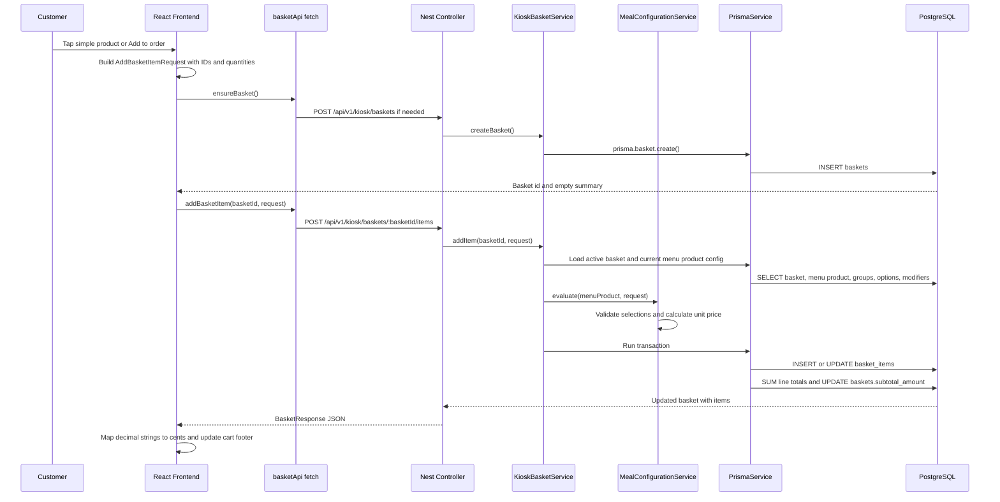

# Basket And Pricing Flow

## Status

Implemented for the current kiosk MVP.

This document explains the full path from a customer tapping a Product Card in the frontend to the backend validating the selection, calculating the final price, writing basket rows, and returning the updated basket summary.

The current frontend is React/Vite. The same architecture maps cleanly to Next.js: browser components or server actions would still send identifiers to a server-side handler, and the final pricing would still be calculated on the server.

## Core Rule

The frontend never owns the final price.

The frontend may show a live estimate so the kiosk feels responsive, but every basket write is recalculated by the NestJS backend from current PostgreSQL data through Prisma.

The frontend sends:

- `menuProductId`
- `quantity`
- selected `productGroupOptionId` values
- selected `modifierOptionId` values
- modifier quantities

The frontend does not send:

- final unit price
- final line total
- product names
- option names
- arbitrary product IDs for meal choices

This prevents a customer or attacker from changing browser state or network payloads to control prices.

## Main Files

Frontend:

- `apps/web/src/app/router.tsx`
- `apps/web/src/features/menu/components/ProductCard.tsx`
- `apps/web/src/pages/ProductDetailsPage/ProductDetailsPage.tsx`
- `apps/web/src/pages/BasketReviewPage/BasketReviewPage.tsx`
- `apps/web/src/features/cart/api/basketApi.ts`
- `apps/web/src/features/cart/components/OrderFooter.tsx`

Backend:

- `apps/api/src/kiosk-basket/kiosk-basket.controller.ts`
- `apps/api/src/kiosk-basket/kiosk-basket.service.ts`
- `apps/api/src/kiosk-basket/meal-configuration.service.ts`
- `apps/api/src/kiosk-basket/meal-configuration.query.ts`
- `apps/api/src/kiosk-order/kiosk-order.controller.ts`
- `apps/api/src/kiosk-order/kiosk-order.service.ts`
- `apps/api/src/prisma/prisma.service.ts`

Database schema:

- `packages/database/prisma/schema.prisma`

## High-Level Sequence



## Step 1: Product Card Decides Direct Add Or Product Details

`ProductCard` is the first decision point.

If `product.hasCustomizations` is true, the card opens Product Details:

```text
Product Card -> ProductDetailsPage
```

This applies to meals, large meals, and standalone products with modifiers or ingredient customization data.

If `product.hasCustomizations` is false, the card can be added directly:

```text
Product Card -> handleQuickAdd() -> handleAddRequest()
```

Direct add uses the smallest possible payload:

```json
{
  "menuProductId": "menu-product-id",
  "quantity": 1
}
```

The frontend does not need to load Product Details for a simple product because there are no customer choices to validate.

## Step 2: Product Details Builds A Configuration Request

Product Details loads full product information from:

```text
GET /api/v1/kiosk/menu-products/:menuProductId
```

That response includes:

- product identity and display data
- regular and linked large meal summaries
- required meal groups
- group options
- option-level modifiers
- top-level product modifiers

The page initializes the first option in every required group. When the customer taps `Add to order`, `ProductDetailsPage` creates an `AddBasketItemRequest`.

Example configured meal request:

```json
{
  "menuProductId": "burger-meal-menu-product-id",
  "quantity": 2,
  "groupSelections": [
    {
      "productGroupId": "choose-burger-group-id",
      "options": [
        {
          "productGroupOptionId": "classic-burger-option-id",
          "quantity": 1,
          "modifierSelections": [
            {
              "modifierOptionId": "extra-bacon-option-id",
              "quantity": 1
            }
          ]
        }
      ]
    },
    {
      "productGroupId": "choose-side-group-id",
      "options": [
        {
          "productGroupOptionId": "large-fries-option-id",
          "quantity": 1
        }
      ]
    }
  ],
  "modifierSelections": []
}
```

Important details:

- `productGroupId` tells the backend which required meal group the selection belongs to.
- `productGroupOptionId` is used instead of product ID, because the same product can appear in different groups or meals with different surcharges.
- nested `modifierSelections` customize a selected meal option, for example extra bacon on the chosen burger.
- top-level `modifierSelections` customize the product itself.

## Step 3: Frontend Ensures A Basket Exists

`AppRouter` owns the current basket ID in a ref.

Before adding an item, it calls `ensureBasket()`:

```text
if basketIdRef.current exists:
  reuse it
else:
  POST /api/v1/kiosk/baskets
```

The frontend request is implemented in `basketApi.createBasket()`.

The backend creates a row in `baskets`:

- `id`
- `session_id`
- `status = ACTIVE`
- `subtotal_amount = 0`

The response gives the frontend a basket ID that can be used for later item writes.

## Step 4: Frontend Sends The Basket Item Request

The item write uses:

```text
POST /api/v1/kiosk/baskets/:basketId/items
```

Implemented by `basketApi.addBasketItem()`.

The frontend fetch wrapper:

- sends JSON
- expects JSON back
- extracts backend error messages when a request fails
- maps decimal string money values into integer cents for UI display

Example backend response shape:

```json
{
  "id": "basket-id",
  "sessionId": "session-id",
  "status": "ACTIVE",
  "subtotalAmount": "53.00",
  "items": [
    {
      "id": "basket-item-id",
      "menuProductId": "menu-product-id",
      "productId": "product-id",
      "productName": "Burger Meal",
      "quantity": 2,
      "unitPrice": "26.50",
      "lineTotal": "53.00",
      "configuration": {
        "version": 1,
        "productType": "MEAL",
        "configuredUnitPrice": "26.50"
      }
    }
  ]
}
```

The frontend maps that into:

- `CartItem[]`
- `CartSummary.itemCount`
- `CartSummary.totalCents`

The `OrderFooter` renders the latest backend basket state.

## Step 5: Controller Receives The Request

`KioskBasketController` defines the public HTTP routes:

```text
POST /api/v1/kiosk/baskets
POST /api/v1/kiosk/baskets/:basketId/items
```

The controller stays thin. It does not calculate prices. It passes the request to `KioskBasketService`.

That separation is important in interviews:

- controller = HTTP boundary
- service = business logic
- Prisma service = database access

## Step 6: Basket Service Validates The Basic Request

`KioskBasketService.addItem()` starts with simple validation:

- `menuProductId` must be present
- `quantity` must be an integer
- `quantity` must be between 1 and 9

Invalid quantity is rejected before database reads.

Then it loads two things:

1. The active basket.
2. The current menu product configuration.

The basket query verifies:

- basket ID matches
- basket status is `ACTIVE`

The menu product query verifies:

- menu product is visible, or it is a linked large meal allowed through the regular meal flow
- menu is active
- restaurant is active
- product is available

The menu product include loads the related data needed for validation:

- product
- product modifier groups
- product modifier options
- product groups
- product group templates
- available group options
- selected option products
- nested modifier groups for those option products

## Step 7: Meal Configuration Service Validates Choices

`MealConfigurationService.evaluate()` is the authoritative validation and pricing step.

It first resolves the base price:

```text
basePrice = MenuProduct.menuPrice ?? Product.basePrice
```

Then it validates top-level modifier selections.

For standalone `ITEM` products:

- group selections are not allowed
- top-level modifiers are allowed when configured

For `MEAL` and `LARGE_MEAL` products:

- product must have between 2 and 4 groups
- every group must be required
- every group must use `SINGLE`
- every group must have `minSelections = 1`
- every group must have `maxSelections = 1`
- every group must have at least one available option
- every submitted group must belong to the meal
- each group can be submitted only once
- every required group must have exactly one option
- meal option quantity must be 1
- the selected option must belong to that group

Modifier validation checks:

- no duplicate modifier option IDs
- selected modifier belongs to the configured item
- selection count matches modifier group min/max rules
- `SINGLE` groups cannot receive multiple selections
- quantity is allowed only when `allowQuantity` is true
- quantity must not exceed `ModifierOption.maxQuantity`
- unknown modifiers are rejected

Common backend rejection cases:

- missing required group
- option submitted for the wrong group
- duplicate group submission
- duplicate modifier submission
- modifier quantity too high
- standalone item submitted with meal groups
- final configured price below zero

## Step 8: Backend Calculates The Final Price

The pricing formula is:

```text
configuredUnitPrice =
  basePrice
  + sum(selected ProductGroupOption.priceAdjustment)
  + sum(selected modifier priceAdjustment * quantity)

lineTotal =
  configuredUnitPrice * item quantity
```

Example:

```text
Burger Meal menu price                 20.00
Premium side option adjustment          4.00
Extra bacon modifier                    2.50
------------------------------------------------
Configured unit price                  26.50

Quantity                                  2
------------------------------------------------
Line total                             53.00
```

Key rule:

The standalone price of an option product is ignored inside a meal.

For example, large fries may cost `11.90` as a standalone product, but inside a meal they may add only `4.00`. The meal-specific surcharge comes from `ProductGroupOption.priceAdjustment`.

The backend uses Prisma `Decimal` values for money. It does not use JavaScript floating-point arithmetic for authoritative totals.

## Step 9: Backend Creates A Configuration Snapshot

After validation, the backend builds a versioned snapshot.

Example:

```json
{
  "version": 1,
  "productType": "MEAL",
  "basePrice": "20",
  "groups": [
    {
      "groupId": "group-side",
      "groupCode": "meal-side",
      "groupName": "Choose your side",
      "selections": [
        {
          "optionId": "option-premium-fries",
          "productId": "fries-product",
          "productName": "Premium Fries",
          "quantity": 1,
          "priceAdjustment": "4",
          "modifiers": []
        }
      ]
    }
  ],
  "modifiers": [],
  "configuredUnitPrice": "26.5"
}
```

The snapshot stores the resolved names, IDs, and prices used at basket-write time.

This matters because catalog data can change later. A product can be renamed, repriced, or hidden, but the basket item still preserves what the customer selected.

## Step 10: Backend Creates A Configuration Fingerprint

The backend normalizes the snapshot using stable key ordering and hashes it with SHA-256.

The result is `configurationFingerprint`.

The fingerprint is used to decide whether a basket write should:

- merge with an existing basket item
- create a separate basket item

Database unique key:

```text
@@unique([basketId, menuProductId, configurationFingerprint])
```

That means:

- same basket + same menu product + same configuration = merge quantities
- same basket + same menu product + different configuration = separate line
- same basket + different menu product = separate line

Example:

```text
Burger Meal + Classic Burger + Regular Fries = line A
Burger Meal + Cheese Burger + Regular Fries  = line B
Burger Meal + Classic Burger + Regular Fries again = merge into line A
```

## Step 11: Basket Service Writes Inside A Transaction

`KioskBasketService.addItem()` writes the item in a Prisma transaction.

Inside the transaction:

1. Try to find an existing `basket_items` row by:
   - `basketId`
   - `menuProductId`
   - `configurationFingerprint`
2. If found:
   - increase `quantity`
   - update `unitPrice`
   - update `lineTotal`
   - update `configurationSnapshot`
3. If not found:
   - create a new `basket_items` row
4. Aggregate all basket item `lineTotal` values.
5. Update `baskets.subtotalAmount`.
6. Return the basket with ordered items.

The transaction prevents the item write and basket subtotal from becoming inconsistent.

## Step 12: Basket Review Updates Existing Basket Lines

Basket Review keeps using the backend as the source of truth.

Quantity changes call:

```text
PATCH /api/v1/kiosk/baskets/:basketId/items/:basketItemId
```

The request body contains only the new quantity:

```json
{
  "quantity": 2
}
```

The backend verifies that:

- the basket item exists
- the item belongs to the active basket
- the new quantity is between 1 and 9

Then it updates the item line total from the stored unit price, recalculates the basket subtotal, and returns the updated basket.

Removing an item calls:

```text
DELETE /api/v1/kiosk/baskets/:basketId/items/:basketItemId
```

The backend deletes the row only when it belongs to the active basket, recalculates the subtotal, and returns the updated basket. The frontend replaces its local basket state with that response.

## Step 13: Basket Review Creates The Order Snapshot

Before payment starts, Basket Review creates an immutable order snapshot:

```text
POST /api/v1/kiosk/orders
```

Request:

```json
{
  "basketId": "basket-id"
}
```

`KioskOrderService` loads the active basket with product and menu context, rejects empty or checked-out baskets, creates an `orders` row, copies each `basket_items` row into `order_items`, and marks the basket as `CHECKED_OUT`.

This preserves:

- product name at checkout time
- product type
- configured unit price
- quantity and line total
- complete `configurationSnapshot`

Payment can then be built against the order total, not mutable basket state.

## Database Rows Written

When the basket is created:

```text
baskets
- id
- session_id
- status
- subtotal_amount
- created_at
- updated_at
```

When an item is added:

```text
basket_items
- id
- basket_id
- menu_product_id
- product_id
- product_name_snapshot
- quantity
- unit_price
- line_total
- configuration_fingerprint
- configuration_snapshot
- created_at
- updated_at
```

When subtotal changes:

```text
baskets.subtotal_amount
```

When an order snapshot is created:

```text
orders
- id
- restaurant_id
- order_number
- status = NEW
- payment_status = PENDING
- subtotal_amount
- total_amount
```

```text
order_items
- order_id
- menu_product_id
- product_id
- product_name
- product_type
- unit_price
- quantity
- line_total
- configuration_snapshot
```

Catalog/pricing rows read during validation:

```text
menu_products.menu_price
products.base_price
products.type
products.is_available
product_groups
product_group_options.price_adjustment
product_group_options.is_available
modifier_groups
modifier_options.price_adjustment
modifier_options.max_quantity
modifier_options.is_available
```

## Error Flow

If the backend rejects the basket write:

1. NestJS throws an HTTP exception.
2. The API returns an error response.
3. `basketApi.request()` reads `body.message` when available.
4. The frontend throws an `Error`.
5. `AppRouter.handleAddRequest()` stores the message in `basketError`.
6. `MenuPage` shows the message as an alert banner.
7. `ProductDetailsPage` also shows item-level submission errors when the user is still on that page.

The frontend can catch and display backend errors, but it does not bypass backend validation.

## Why This Design Is Good For Interviews

A concise explanation:

> The React frontend collects customer choices and sends only IDs and quantities through fetch. The NestJS controller receives the request and delegates to a service. The service loads the current product, meal groups, options, and modifiers through Prisma. A dedicated configuration service validates the submitted choices and recalculates the configured unit price from database values. The basket service then writes or merges the basket item in a database transaction, recalculates the basket subtotal, and returns the updated basket to the frontend. The frontend updates its cart footer from the backend response.

Important concepts shown:

- REST API communication with JSON
- frontend state vs backend source of truth
- server-side validation
- server-side pricing
- Prisma as ORM/data access layer
- PostgreSQL transactions
- snapshotting mutable catalog data
- idempotent merge behavior through normalized configuration fingerprints
- safe error handling from backend to frontend

## How This Maps To Next.js

In a Next.js version, the same responsibilities remain.

With a separate NestJS backend:

```text
Next.js Client Component -> fetch -> NestJS API -> Prisma -> PostgreSQL
```

With Next.js route handlers:

```text
Next.js Client Component -> fetch /api/baskets -> route handler -> Prisma -> PostgreSQL
```

With Server Actions:

```text
Client Component -> Server Action -> Prisma -> PostgreSQL
```

In all versions, the final pricing and database writes must stay on the server. Browser code can improve UX with live estimates, but it should not be trusted for money, availability, or order state.
